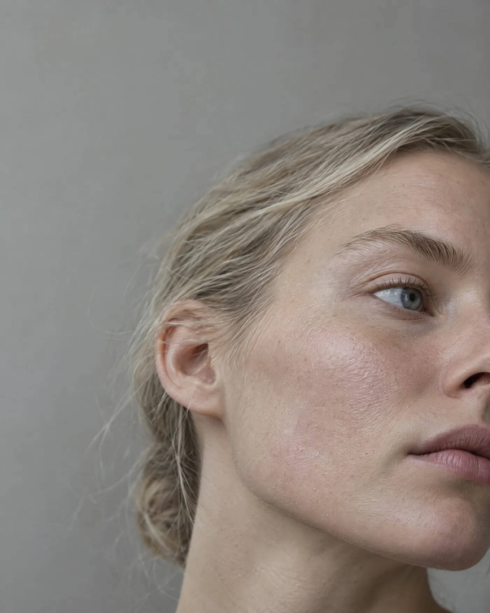

# Projekt: gustafbarlund.se

Statisk säljsida för Gustaf Bärlund, enskild firma i Växjö som säljer
annonsmaterial till hudkliniker och skönhetssalonger i Småland.

Sidan har ett enda jobb: en klinikägare som fått ett kallt mejl klickar på
länken och ska inom tio sekunder tro att avsändaren är seriös. Allt på sidan
ska tjäna det. Inget annat.

---

## Läs detta först

`index.html` i repot är utgångspunkten och är redan färdigskriven och
godkänd. Bygg vidare på den, skriv inte om den från grunden. Den innehåller
allt innehåll, all copy och hela designsystemet.

Det som återstår är: bilderna in, annonskomponenterna, meta och OG, deploy.

---

## Designbeslut som är låsta

Ändra inte dessa utan att fråga.

**Färger**

```
--paper #F4F2EC   bakgrund
--ink    #191815   text
--ink-2  #5E5B52   dämpad text
--ink-3  #8F8B7F   etiketter
--cell   #E3E0D6   bildrutor och platshållare
--line   #D5D1C6   linjer
```

Mörkt läge finns definierat i `:root` under `prefers-color-scheme: dark`
och under `[data-theme="dark"]`. Behåll båda.

Det finns **ingen accentfärg**. Den enda "färgen" på sidan är en helsvart
ruta bland ljusa i kontaktarket. Lägg inte till en accentfärg.

**Typsnitt**

Archivo från Google Fonts, vikter 400, 500, 600. Rubriker i 600 med
letter-spacing runt -0.025em. Brödtext i 400. Inget andra typsnitt, ingen
serif, ingen monospace.

**Den bärande idén: kontaktarket**

Sidan är byggd som ett fotografiskt kontaktark. Numrerade rutor i 4:5,
tjugo stycken i hero, varav en är svart. Det illustrerar produkten och
huvudbudskapet samtidigt: tjugo annonser i månaden, ungefär en av dem blir
en vinnare. Rutnätet återkommer i Arbetet där varje vinkel har fyra rutor.

Behåll det. Det är sidans enda visuella idé och den ska inte spädas ut.

---

## Detta får inte hända

Sidan har gått igenom fyra versioner för att undvika två fällor. Gå inte
tillbaka i någon av dem.

**1. Får inte se AI-genererad ut.** Konkret förbjudet:

- serif blandat med grotesk i samma sida
- små versala etiketter i monospace över varje sektion
- kort med rundade hörn och skuggor
- rutnät av sifferboxar
- emoji som sektionsmarkörer
- gradienter
- allt centrerat
- "eyebrow"-etikett ovanför varenda rubrik

**2. Får inte likna raket.digital.** Den sajten var referens och kopierades
av misstag i en tidigare version. Förbjudet: nästan svart bakgrund med
benvit text, geometriska former inbakade i rubriker, pil som designelement,
handritad oval runt sektionsetiketter, dragspel med plustecken.

---

## Filstruktur

```
/
  index.html
  /img
    01-narbild-hud.webp
    02-fore-efter.webp
    03-behandlingsrum.webp
    04-portratt.webp
    05-stilleben.webp
    06-behandling.webp
    og.jpg
  favicon.svg
  CLAUDE.md
```

Håll det platt. Ingen byggkedja, ingen npm, inget ramverk. Det är en
HTML-fil med inline CSS och det ska den förbli.

---

## Bilderna

Sex bilder finns genererade i 1792x2240 px PNG. De laddas ner manuellt och
läggs i `/img`.

**Optimering:** konvertera till webp, kvalitet runt 80, max 1400 px bredd,
mål under 200 kB per fil. `cwebp -q 80 -resize 1400 0 in.png -o out.webp`
eller motsvarande med sharp.

Sätt `width` och `height` på varje `img` så sidan inte hoppar under
inladdning, och `loading="lazy"` på allt utom det som syns direkt.

**Viktigt om bilderna:** de innehåller medvetet ingen text. De har tom yta i
övre tredjedelen där rubriken ska sitta. Texten sätts som riktig HTML
ovanpå bilden, aldrig genererad in i bilden.

---

## Annonskomponenten

Det här är sidans viktigaste tekniska del. Varje portföljannons är en
komponent, inte en färdig bild.

```html
<figure class="ad">
  <div class="ad-frame">
    
    <p class="ad-head">Torr hud som inte blir bättre hur mycket kräm du än lägger på?</p>
    <p class="ad-cta">Boka en hudanalys</p>
  </div>
  <figcaption>
    <b>Problemet.</b> Namnger besväret med kundens egna ord.
    Strukturen är lånad från en annons som körts i Sverige sedan maj.
  </figcaption>
</figure>
```

Krav på `.ad-frame`:

- `position: relative`, `aspect-ratio: 4/5`, `overflow: hidden`
- bilden `position:absolute; inset:0; width:100%; height:100%; object-fit:cover`
- rubriken absolut placerad i övre tredjedelen, Archivo 600, vit, med en
  mjuk mörk gradient bakom sig för läsbarhet
- rubriktexten ska skala med containern, inte med skärmen: använd `cqw` med
  `container-type: inline-size` på `.ad-frame`, annars spricker layouten när
  annonsen visas i tre kolumner

Poängen med komponenten: samma bild plus fem olika rubriker ger fem
annonser. Det är produkten Gustaf säljer, och sidan ska demonstrera den.

---

## Meta, OG och favicon

Detta är det som avgör om länken ser seriös ut när den klistras in i ett
mejl. Gör det ordentligt.

```html
<title>Gustaf Bärlund — annonsmaterial för kliniker i Småland</title>
<meta name="description" content="Tjugo nya annonser i månaden till en klinik per stad. Växjö.">
<meta property="og:title" content="Tjugo nya annonser i månaden. En av dem vinner.">
<meta property="og:description" content="Annonsmaterial för hudkliniker och salonger. En klinik per stad.">
<meta property="og:image" content="https://gustafbarlund.se/img/og.jpg">
<meta property="og:url" content="https://gustafbarlund.se/">
<meta property="og:type" content="website">
<meta name="twitter:card" content="summary_large_image">
```

OG-bilden ska vara 1200x630 px JPEG under 300 kB. Bygg den av
kontaktarket: rutnätet med den svarta rutan, på papper, med rubriken
bredvid. Den syns i varje mejl han skickar, så den är värd en halvtimme.

Favicon som SVG: en enkel svart fyrkant i 4:5-proportion på papper. Samma
idé som kontaktarket.

---

## Prestanda

Mål: laddad på under en sekund på mobil, Lighthouse över 95.

- Google Fonts med `display=swap` och `preconnect`, bara vikterna 400, 500, 600
- inga bibliotek, ingen JavaScript utöver eventuell smooth scroll
- webp på alla bilder
- `<html lang="sv">`

---

## Innehåll som inte får ändras utan att fråga

**Priset.** 4 900 kr i månaden står utskrivet. Det är avsiktligt, det
filtrerar bort dem som inte har budget.

**Frågan "Lovar du att jag säljer mer?"** och svaret som börjar med Nej.
Det är sidans starkaste stycke. Mjuka inte upp det.

**Raden under koncepten:** "Konceptförslag framtagna på eget initiativ.
Inte utförda kunduppdrag." Den måste stå kvar så länge portföljen består av
spec-arbete. Ta aldrig bort den.

**Siffrorna i Läget-sektionen** (45 aktiva annonser, 0 från Växjö, 9
månaders längsta körning) kommer från Metas annonsbibliotek den 12
september 2026. Om de uppdateras ska datumet uppdateras med dem.

---

## Deploy

Cloudflare Pages, gratis.

1. Pusha repot till GitHub
2. Cloudflare Pages, anslut repot, build command tom, output directory `/`
3. Custom domain `gustafbarlund.se` och `www` som redirect till apex
4. Namnservrarna hos Loopia pekar redan till Cloudflare

E-post ligger hos Zoho. Rör inte MX-posterna i Cloudflare DNS när du
konfigurerar sidan, annars slutar mejlen fungera.

---

## Arbetssätt

Fråga innan du lägger till något som inte står här. Sidan är medvetet
liten, och varje sak som läggs till gör den mindre trovärdig, inte mer.

Om något ska bort är det hellre en sektion än en detalj.
